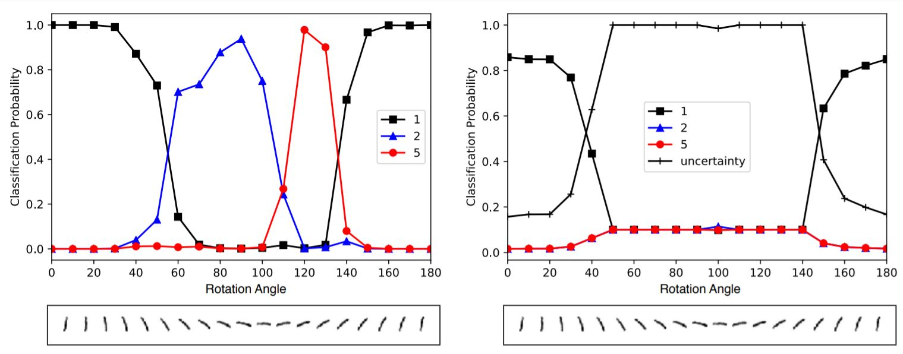

# Evidential Deep Learning with PyTorch



This repository contains a demontstration of how to build, train and evaluate a neural network capable of measuring epistemic uncertainty as proposed by the authors of [*Evidential Deep Learning to Quantify Classification Uncertainty*](https://arxiv.org/pdf/1806.01768.pdf), as well as some experiments performed on such architectures.

## Resources

* Dataset: [MNIST](https://en.wikipedia.org/wiki/MNIST_database) - sourced from [TorchVision](https://pytorch.org/vision/stable/datasets.html#mnist)
* Working environment: Ubuntu18.04 LTS / Python 3.6.9 / virtualenv
* Use the `Makefile` commands to:
  * create the project virtual environment
  * print the source terminal command to activate environment in terminal
  * run tensorboard to view training progress & results


## Project structure

```
├── environment                         # Definition and contents of the project virtualenv
├── output                              # Stores model training results
│   └── lightning_logs                  # Generated automatically by pytorch-lightning during training
├── src                                 # Source files of the project
│   ├── dataset                         # Stores classes used in building and managing the project dataset
│   ├── model                           # Stores classes used in building and running the model
│   └── settings                        # Stores constants, configurations and utilities used across the repo   

```